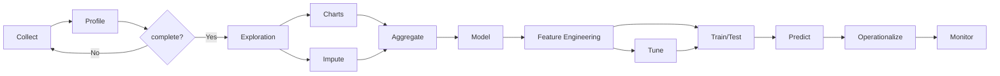
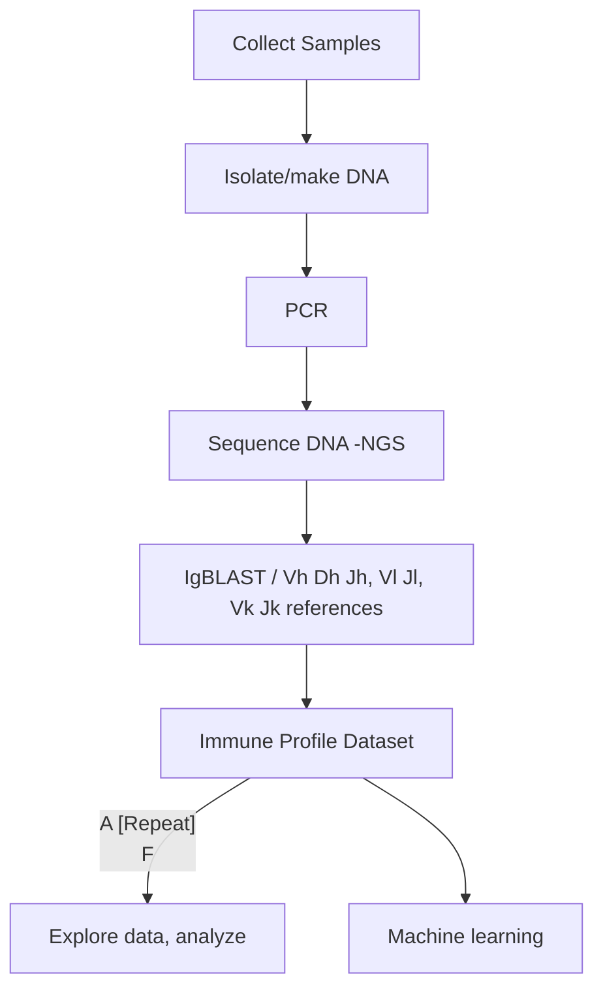

# A Gentle Introduction to ML/AI as Applied to Antibody Engineering

**Team Smith Roster**
| Role | Participant | Affiliation |
| ----------- | ----------- | ----------- |
| Team Lead | Todd Smith, PhD | Digital World Biology, LLC |
| Tech Lead | Herminio Vazquez | Copado Inc. |
| Flex | Zainab Adenaike | NIH/NLM/NCBI |
| Flex | Jake Lance | student, University of Toronto |
| Flex | Mohsen Sharifi Renani | Spotify AB|
| Writer | Stephen Panossian | Unaffiliated |

## Project Goals

The project focused on developing resources and documentation for teacing data science and machine learning / artificial intelligence (ML/AI) cocepts related to antibody engineering. Immune profiling (immunoprofiling) datasets were used as a source of antibody sequneces for both data science and ML. The team develope Jupyter notebooks to undertake comparative analyses of iReceptor datasets, and then incorporate the AbLang2 antibody-specific language model to characterize data from CoV-AbDab. A dictionary and glossary of terms defining essential computer and biology terms related to the computations processed within the Jupyter notebook were also developed. 

## Methods
### Datasets
- CoV-AbDab database in csv format. [CoV-AbDab](https://opig.stats.ox.ac.uk/webapps/covabdab/) is a public database to document all published/patented antibodies and nanobodies able to bind to coronaviruses, including SARS-CoV2, SARS-CoV1, and MERS-CoV. The codathon used the Feb 8, 2024 release containing 12,916 entries. Entries are highly annotated and indicate neutralizing ability, kind of receptor (antibody, nanobodie), where data are pair (heavy and light chaing, just heavy), epitope bound, if a stucture exists, virus reactivitiy among others.
- [iReceptor](https://gateway.ireceptor.org) (free account required) lymphoma dataset uptained with the following filters: **Study ID**: PRJEB1289; **Study type** Case Control (Ontology ID): NCIT:C15197; **Filter by Sample > PCR target**: IGH or IGK or IGL
### Software 
- Immune Profiling: See notebooks for details: Key python libraries include Pandas for structuring and manipulating data, json for reading metadata, Matplot lib for graphing and Seaborn for exploring correlations between data in columns.
- Machine learning: [AbLang2](https://github.com/TobiasHeOl/AbLang2)

The following diagrams represent the high-level methods employed in Data Science and Bioinformatics

### Example Data Method

See [mermaid](https://github.blog/2022-02-14-include-diagrams-markdown-files-mermaid) to learn about making the figure.

## Antibody (Immune Profiling)Sequencing

     
## Approach
The team used software tools including Amazon Web Service (AWS) cloud computing accounts, Jupyter notebooks, and datasets from both iReceptor and SAbDab (The Structural Antibody Database) from the Oxford Protein Information Group (OPIG). The team will also identify relevant NCBI SRA (Sequence Read Archive) datasets. The general workflow is: 1) create an AWS instance, 2) step through the enclosed Jupyter notebook, and 3) analyze the antibody results. Minor experimentation was done with Docker containers. 

Prior work illustrates this approach:

Example: Covid not Covid 
- https://github.com/AntibodyEngineers/covid-not-covid
- notebook: https://github.com/AntibodyEngineers/covid-not-covid/blob/main/ab_predict_neutralising.ipynb
- datafile: covabdab_all.csv

Example: Immune Profiling
- https://github.com/AntibodyEngineers/immune-profiling
- data: (https://gateway.ireceptor.org/sequences?query_id=85212), needs to be uploaded to our Amazon instance

**2024 ML/AI Codeathon Log**
| Date | Issues |
| ----------- | ----------- |
| 26-Feb-2024 | Several issues utilizing Docker |
| 27-Feb-2024 | Team accessed AWS account and Jupyter notebook; runtime challenges |
| 28-Feb-2024 | None reported |
| 29-Feb-2024 | None reported |
| 01-Mar-2024 |  |

## Results
Many jupyter notebooks and notebook fragements were created all are in the [notebooks](notebooks/) folder. The most instructive notebooks are:
### Machine Learing
- [ab_predict_neutralising.ipynb](notebooks/ab_predict_neutralising.ipynb) the notebook from [Covid-not-Covid](https://github.com/AntibodyEngineers/covid-not-covid) that was used as a starting point for this work. 
- [ab_predict_neutralising_final.ipynb](ab_predict_neutralising_final.ipynb) includes working code plus descriptions of the machine learning process and rational for certain choices. In addition code is included for exploring the dataset that was used for training and testing the model.
### Immune Profiling
- [Herminio.ipynb](notebooks/Herminio.ipynb) provides a few simple examples of using markdown in jupyter notebooks.
- [ireceptor.ipynb](notebooks/ireceptor.ipynb) was a notebook from [Immune Profilling](https://github.com/AntibodyEngineers/immune-profiling) and was used as a starting point for this work.
- [ireceptor-herminio.ipynb](notebooks/ireceptor-herminio.ipynb) demonstrates several pyton libraries and code that are used to explore a large dataset and introduces parquet files as a way to efficiently work with large datasets.
- [ireceptor-mohsen.ipynb](notebooks/ireceptor-mohsen.ipynb) add PCA plotting.

## Future Work

Project materials will create a resource with instruction and hands-on examples that can demystify ML/AI for many scientists and students who need greater awareness of the data, steps, and practicalities. The focus on antibodies supports work in basic research and biotechnology. Digital World Biology's Antibody Engineering Hackathons are creating materials for course-base undergraduate research in community colleges (https://antibody-engineers.org/).

The resulting work will be used in Digital World Biology's National Science Foundation funded summer hackathon (August 2024) on antibody engineering. In the project we will consider ML applications for predicting antibody antigen recognition, genetic contributions to antibody expression, and de novo antibody design. Work will identify one or two examples that include specific datasets, workflows, an appropriate ML method, and tests. The examples will then be used to create instructions and explanations that can be used in classroom settings, starting points for undergraduate research, and scientists wishing they had ways to better understand ML.

## NCBI Codeathon Disclaimer
This software was created as part of an NCBI codeathon, a hackathon-style event focused on rapid innovation. While we encourage you to explore and adapt this code, please be aware that NCBI does not provide ongoing support for it.

For general questions about NCBI software and tools, please visit: [NCBI Contact Page](https://www.ncbi.nlm.nih.gov/home/about/contact/)

