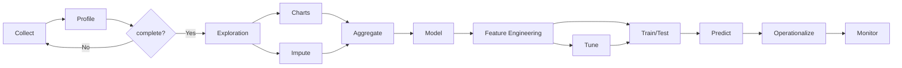

# A Gentle Introduction to ML/AI as Applied to Antibody Engineering

**Team Smith Roster**
| Role | Participant | Affiliation |
| ----------- | ----------- | ----------- |
| Team Lead | Todd Smith, PhD | Digital World Biology, LLC |
| Tech Lead | Herminio Vazquez | Copado Inc. |
| Writer | Stephen Panossian | Unaffiliated |
| Flex | Zainab Adenaike | NIH/NLM/NCBI |
| Flex | Jake Lance | student, University of Toronto |
| Flex | Mohsen Sharifi Renani | Spotify AB|

## Project Goals

This project focuses on applying machine learning and artificial intelligence (ML/AI) methods to immunoprofiling. The team will develop a Jupyter notebook and underlying software to first undertake comparative analyses of the iReceptor dataset, and then incorporate the AbLang2 antibody-specific language model to characterize data within the Structural Antibody Database. Also, the team will develop a dictionary/glossary defining essential computer and biology terms related to the computations processed within the Jupyter notebook.

## Methods

The following diagrams represent the high-level methods employed in Data Science and Bioinformatics

### Data Method

## Approach
The team will use software tools including Amazon Web Service (AWS) cloud computing accounts, Docker containers, Jupyter notebooks, and datasets from both iReceptor and SAbDab (The Structural Antibody Database) from the Oxford Protein Information Group (OPIG). The team will also identify relevant NCBI SRA (Sequence Read Archive) datasets. The general workflow is: 1) create an AWS instance, 2) upload a Docker container, 3) step through the enclosed Jupyter notebook, and 4) analyze the antibody results. Prior work illustrates this approach:

Example: Covid not Covid 
- https://github.com/AntibodyEngineers/covid-not-covid
- notebook: https://github.com/AntibodyEngineers/covid-not-covid/blob/main/ab_predict_neutralising.ipynb
- datafile: covabdab_all.csv

Example: ImmuneProfiling
- https://github.com/AntibodyEngineers/immune-profiling
- data: (https://gateway.ireceptor.org/sequences?query_id=85212), needs to be uploaded to our Amazon instance

**2024 ML/AI Codeathon Log**
| Date | Issues |
| ----------- | ----------- |
| 26-Feb-2024 | Several issues utilizing Docker |
| 27-Feb-2024 | Team accessed AWS account and Jupyter notebook; runtime challenges |
| 28-Feb-2024 | None reported |
| 29-Feb-2024 |  |
| 01-Mar-2024 |  |

## Results

## Future Work

Project materials will create a resource with instruction and hands-on examples that can demystify ML/AI for many scientists and students who need greater awareness of the data, steps, and practicalities. The focus on antibodies supports work in basic research and biotechnology. Digital World Biology's Antibody Engineering Hackathons are creating materials for course-base undergraduate research in community colleges (https://antibody-engineers.org/).

The resulting work will be used in Digital World Biology's National Science Foundation funded summer hackathon (August 2024) on antibody engineering. In the project we will consider ML applications for predicting antibody antigen recognition, genetic contributions to antibody expression, and de novo antibody design. Work will identify one or two examples that include specific datasets, workflows, an appropriate ML method, and tests. The examples will then be used to create instructions and explanations that can be used in classroom settings, starting points for undergraduate research, and scientists wishing they had ways to better understand ML.

## NCBI Codeathon Disclaimer
This software was created as part of an NCBI codeathon, a hackathon-style event focused on rapid innovation. While we encourage you to explore and adapt this code, please be aware that NCBI does not provide ongoing support for it.

For general questions about NCBI software and tools, please visit: [NCBI Contact Page](https://www.ncbi.nlm.nih.gov/home/about/contact/)

